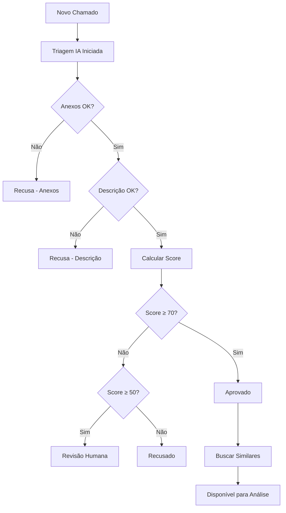

# 🤖 Triagem Automática de Chamados - WEX Intelligence

## 📋 Visão Geral

Este documento define as regras e parâmetros para a triagem automática de chamados realizada pela Inteligência Artificial do sistema WEX Intelligence. A IA é responsável por realizar uma análise inicial de todos os chamados, garantindo que apenas aqueles que atendem aos critérios mínimos sejam direcionados para análise humana.

---

## 🎯 Objetivos da Triagem

### **Principais Metas:**
- **Automatizar** a validação inicial de chamados
- **Reduzir** a carga de trabalho manual dos analistas
- **Garantir** qualidade mínima dos chamados antes da análise
- **Acelerar** o processo de resolução de problemas
- **Identificar** padrões e problemas recorrentes

---

## ⚙️ Regras de Triagem Inicial

### **1. Triagem Inicial**

#### **Critérios de Validação:**

##### **📎 Anexos Obrigatórios**
- **Verificação de presença**: Todos os anexos obrigatórios devem estar presentes
- **Validação de formato**: Anexos devem estar em formatos aceitos (.pdf, .doc, .docx, .xls, .xlsx, .png, .jpg)
- **Verificação de integridade**: Arquivos não corrompidos e acessíveis
- **Tamanho adequado**: Anexos entre 1KB e 50MB

##### **📝 Conteúdo Mínimo**
- **Descrição clara**: Mínimo de 50 caracteres na descrição
- **Título preenchido**: Título deve ter entre 10 e 200 caracteres
- **Cliente identificado**: Campo cliente_solicitante obrigatório
- **Criticidade definida**: Nível de criticidade deve estar especificado

##### **🔍 Informações Técnicas**
- **Número WEX válido**: Formato correto do número WEX
- **Data válida**: Data de criação não pode ser futura
- **Status inicial**: Status deve ser "Aberto" para novos chamados

---

### **2. Ações da Triagem**

#### **✅ Chamados Aprovados**
Quando um chamado **PASSA** na triagem:
- Status permanece **"Aberto"**
- Adicionado flag `triagem_ia_aprovada: true`
- Registrado log de aprovação
- Disponibilizado para análise humana
- Calculado score de qualidade inicial

#### **❌ Chamados Recusados**
Quando um chamado **NÃO PASSA** na triagem:
- Status alterado para **"Recusado pela IA"**
- Adicionado flag `triagem_ia_aprovada: false`
- Registrado motivo específico da recusa
- Enviado feedback automático ao cliente
- Removido da fila de análise

#### **⚠️ Chamados em Revisão**
Para casos **DUVIDOSOS**:
- Status alterado para **"Aguardando Revisão"**
- Adicionado flag `triagem_ia_revisao: true`
- Priorizado para análise humana
- Destacado na interface

---

## 🔍 Critérios de Aprovação Detalhados

### **Pontuação de Qualidade (0-100)**

#### **Anexos (0-30 pontos)**
- Todos anexos obrigatórios presentes: **+20 pontos**
- Anexos em formato correto: **+5 pontos**
- Anexos com tamanho adequado: **+3 pontos**
- Nomes de arquivo descritivos: **+2 pontos**

#### **Descrição (0-25 pontos)**
- Descrição clara e detalhada (>100 chars): **+15 pontos**
- Uso de palavras-chave técnicas: **+5 pontos**
- Estrutura organizada: **+3 pontos**
- Ausência de erros graves: **+2 pontos**

#### **Informações Técnicas (0-25 pontos)**
- Cliente claramente identificado: **+10 pontos**
- Criticidade apropriada: **+5 pontos**
- Título descritivo: **+5 pontos**
- Data/hora válidas: **+3 pontos**
- Número WEX correto: **+2 pontos**

#### **Contexto (0-20 pontos)**
- Problema claramente definido: **+10 pontos**
- Impacto mencionado: **+5 pontos**
- Urgência justificada: **+3 pontos**
- Tentativas de solução mencionadas: **+2 pontos**

### **Thresholds de Aprovação**
- **Score ≥ 70**: ✅ **Aprovado automaticamente**
- **Score 50-69**: ⚠️ **Revisão humana necessária**
- **Score < 50**: ❌ **Recusado automaticamente**

---

## 📊 Análise de Similaridade

### **Detecção de Chamados Similares**

Para chamados **aprovados**, a IA identificará:

#### **Critérios de Similaridade:**
- **Palavras-chave similares** na descrição (>70% match)
- **Mesmo cliente** com problemas recorrentes
- **Criticidade igual** em período recente
- **Tipo de erro similar** baseado em padrões

#### **Apresentação na Interface:**
```
📋 Chamado #WEX123456
┣━━ 🔍 Chamados Similares Encontrados (3)
┃   ┣━━ #WEX123400 (85% similar) - Mesmo cliente, erro parecido
┃   ┣━━ #WEX123401 (78% similar) - Padrão de falha similar
┃   ┗━━ #WEX123402 (72% similar) - Mesma categoria de problema
```

---

## 📈 Visão Geral e Métricas

### **Dashboard de Triagem**

#### **Métricas Principais:**
- **Total de chamados processados**
- **% Aprovação automática**
- **% Recusa automática** 
- **% Aguardando revisão**
- **Score médio de qualidade**
- **Tempo médio de triagem**

#### **Métricas por Período:**
```
📊 Últimas 24 horas:
┣━━ Processados: 127 chamados
┣━━ ✅ Aprovados: 89 (70%)
┣━━ ❌ Recusados: 28 (22%)
┣━━ ⚠️ Revisão: 10 (8%)
┗━━ 📈 Score médio: 67.3
```

#### **Top Motivos de Recusa:**
1. **Anexos obrigatórios ausentes** (45%)
2. **Descrição insuficiente** (23%)
3. **Cliente não identificado** (18%)
4. **Formato de anexo inválido** (14%)

---

## 🚨 Motivos de Recusa Automática

### **Critérios Eliminatórios:**
- ❌ **Anexos obrigatórios ausentes**
- ❌ **Descrição com menos de 20 caracteres**
- ❌ **Cliente não identificado**
- ❌ **Número WEX inválido ou duplicado**
- ❌ **Anexos corrompidos ou inacessíveis**
- ❌ **Formato de anexo não suportado**
- ❌ **Tamanho de anexo excede 50MB**

### **Mensagens de Feedback Automático:**

#### **Anexos Ausentes:**
```
🤖 TRIAGEM AUTOMÁTICA - CHAMADO RECUSADO

Motivo: Anexos obrigatórios não encontrados
Ação necessária: Anexe os documentos obrigatórios e reenvie
Documentos esperados: [lista específica]
```

#### **Descrição Insuficiente:**
```
🤖 TRIAGEM AUTOMÁTICA - CHAMADO RECUSADO

Motivo: Descrição muito breve ou unclear
Ação necessária: Forneça uma descrição detalhada do problema
Mínimo esperado: 50 caracteres com contexto claro
```

---

## 🔄 Fluxo de Triagem

### **Processo Completo:**



---

## 🛠️ Configurações Técnicas

### **Parâmetros Ajustáveis:**

#### **Thresholds de Score:**
```python
SCORE_APROVACAO_AUTOMATICA = 70
SCORE_REVISAO_HUMANA = 50
SCORE_RECUSA_AUTOMATICA = 49
```

#### **Pesos dos Critérios:**
```python
PESO_ANEXOS = 0.30
PESO_DESCRICAO = 0.25
PESO_INFO_TECNICAS = 0.25
PESO_CONTEXTO = 0.20
```

#### **Limites de Conteúdo:**
```python
MIN_DESCRICAO_CHARS = 50
MAX_DESCRICAO_CHARS = 5000
MIN_TITULO_CHARS = 10
MAX_TITULO_CHARS = 200
MAX_ANEXO_SIZE_MB = 50
```

---

## 📝 Logs e Auditoria

### **Registro de Triagem:**
Cada triagem gera um log com:
- **Timestamp** da análise
- **ID do chamado** analisado
- **Score calculado** e breakdown
- **Decisão tomada** (aprovado/recusado/revisão)
- **Motivos específicos** da decisão
- **Tempo de processamento**
- **Chamados similares encontrados**

### **Exemplo de Log:**
```json
{
  "timestamp": "2025-10-07T14:30:00Z",
  "chamado_id": "WEX123456",
  "score_total": 75,
  "score_breakdown": {
    "anexos": 25,
    "descricao": 20,
    "info_tecnicas": 20,
    "contexto": 10
  },
  "decisao": "aprovado",
  "tempo_processamento_ms": 250,
  "similares_encontrados": 3,
  "observacoes": "Chamado bem estruturado, anexos completos"
}
```

---

**Status:** 📋 **DOCUMENTO DE TRIAGEM CRIADO**  
**Data:** 07 de Outubro de 2025  
**Versão:** 1.0  
**Próximo passo:** Implementação das regras na IA de triagem